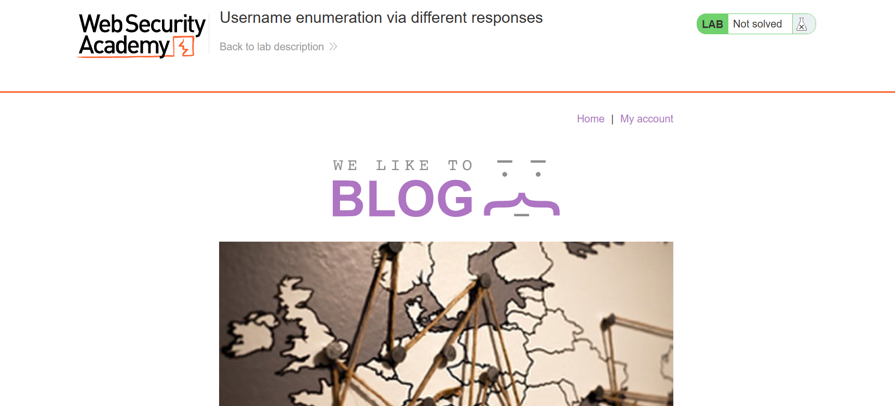

### Username enumeration via different responses

\](images/username_01.png)](images/username_01.png)
Mục tiêu: Tìm được username&password hợp lệ

Đầu tiên, mở Burp truy cập vào bài lab.

Bởi vì bài lab này tập trung vào việc dò tìm tài khoản, do đó mình chỉ tập trung vào phần đăng nhập của nó.


](images/username_03.png)

Thử một tài khoản ngẫu nhiên:
```
Username: abc
Password: password
```
Và tất nhiên, kết quả trả về báo lỗi, cụ thể là sai username.
](images/username_04.png)

Quay lại với burp suite, ta tìm đến phần vừa test tài khoản, và send request tới intruder.
](images/username_05.png)

Tại intruder, ta thay lần lượt các username vào vị trí mà mình vừa nhập username lúc thử bằng chức năng Sniper attack:
](images/username_06.png)

Sau khi thử, có một username mang Length khác biệt so với các username còn lại, kiểm tra response của nó và ta thấy một thông báo Incorrect password, tức là đã đúng username.
](images/username_07.png)

Quay lại intruder, ta thay username bằng username hợp lệ vừa tìm được, và tương tự, thử lần lượt các password bằng Sniper attack, nhận được password hợp lệ cho username từ trạng thái nhận được:
](images/username_08.png)

Trở lại giao diện bài lab, nhập username và password mới tìm được để hoàn thành bài này.
](images/username_09.png)